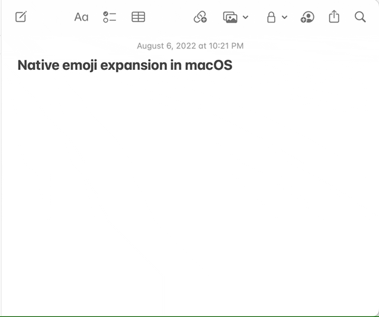
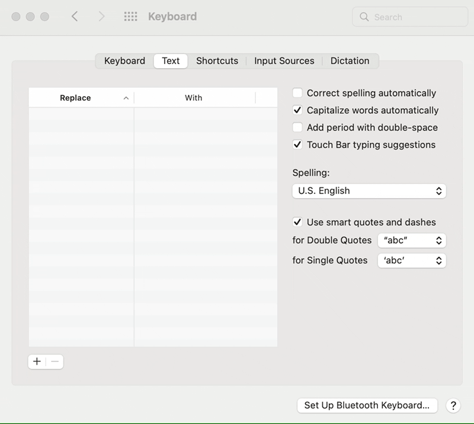

# Native emoji expansion in macOS

Expand Emoji shortcodes (like `:smile:`), using native macOS text expansion.

## How to Install

1. Download the latest `emoji.plist` from the [releases](https://github.com/nathanmsmith/macos-emoji-snippets/releases).
2. Go to System Preferences > Keyboard > Text
3. Drag `emoji.plist` into your table.
4. Emoji responsibly 🙌
